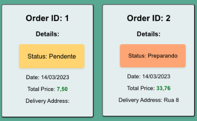

# Summary

Delivery App: an e-commerce web application built using React and Node.js. The objective of the project was to create a user-friendly e-commerce platform that allows customers to browse and purchase products and helps businesses manage their inventory and orders. The application's user interface was built using React, a popular and powerful JavaScript library commonly used in the frontend. The application consists of several pages that cover the entire flow of customers, vendors, and administrators. New customers can register on the homepage, list available products, and make purchases. Vendors can manage sales statuses, and administrators manage and register users in the database.

In the frontend, we used React and JavaScript to design the UI, following the atomic model principle of an application. We used Context API and WebStorage for global state management and React Router for application routing.

The application's backend was built using Node.js, a fast and scalable server-side execution environment. The backend includes a RESTful API that allows the user interface to communicate with the database and perform CRUD operations. The API manages products, order processing, and user authentication through JSON Web Tokens. We used MySQL as a relational database and Sequelize as an ORM.

Overall, this project was an excellent opportunity for us to apply our skills in React and Node.js to build a real-world application that solves a real problem. We are pleased with the final result and the development of our hard and soft skills.

## Technologies/Stacks used:

  ### Front-End:
    * React.JS
    * React Router
    * Context API
    * Vanilla JS
    * Web Storage

  ### Back-End:
    * Node.JS
    * Express
    * Sequelize
    * MySQL
    * Express Async Errors
    * JWT
    * Md5

## Sample:

  
  
  
  
  
  
  

